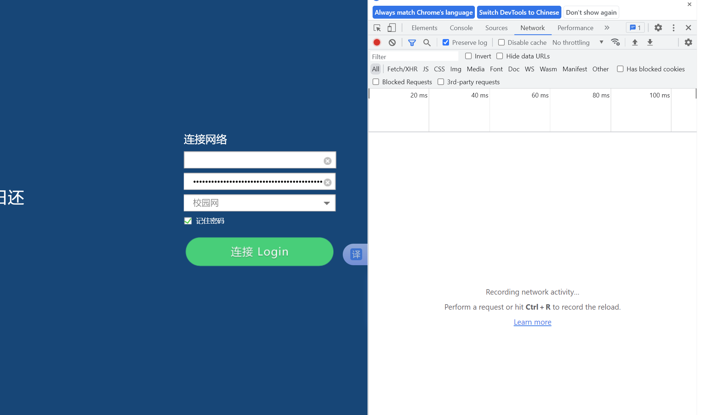
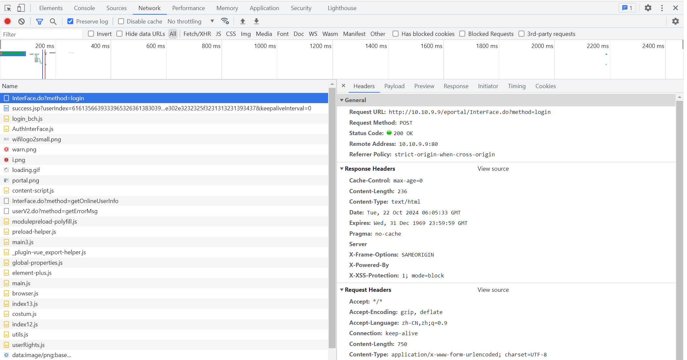
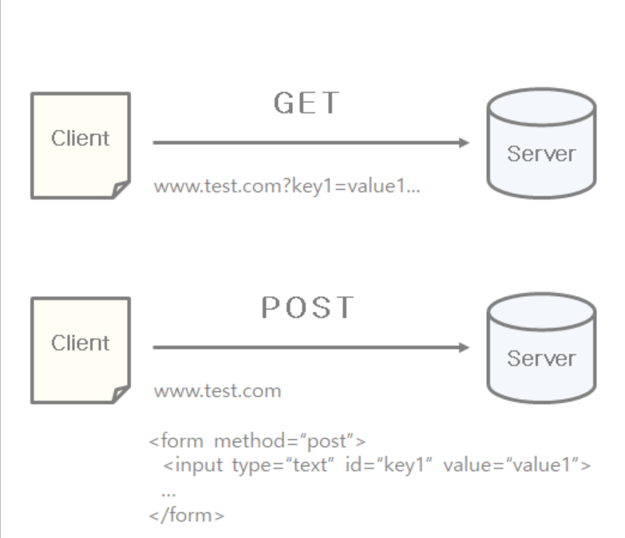
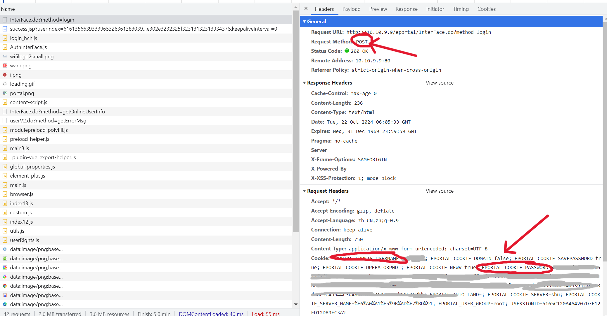
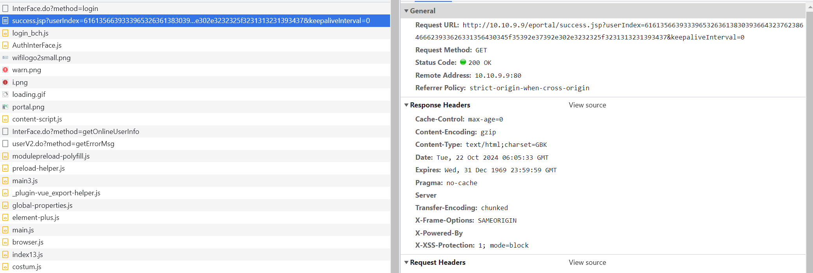
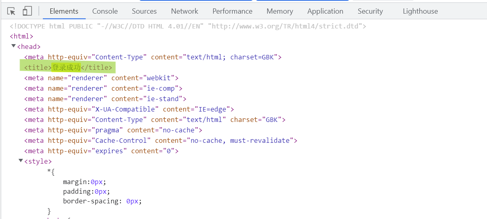
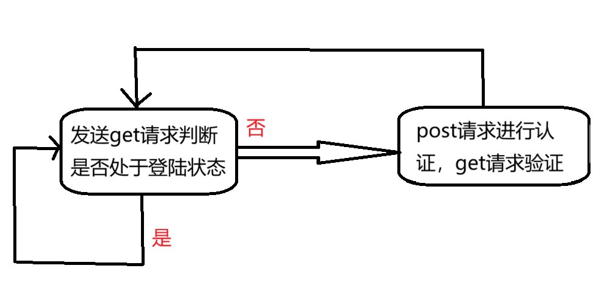
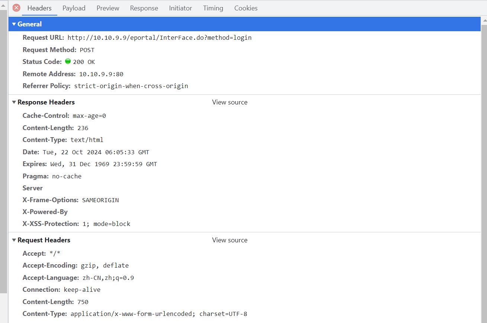
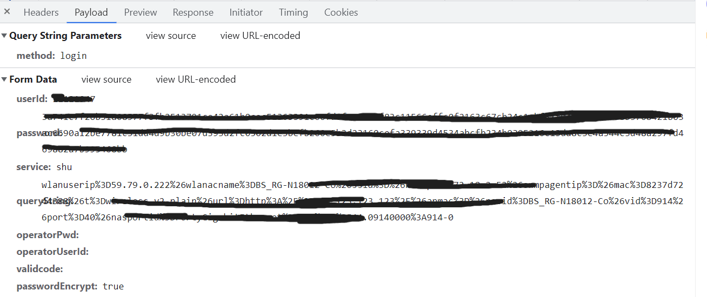

# 上海大学校园网自动登录脚本

## 适用情况：

- 平时我们有远程连接实验室电脑的需求，但是实验室电脑不在身边可能无法进行校园网账户认证，进而无法实现远程工具的连接。
- IOT或者其他嵌入式设备想要连接校园网但是因为没有桌面操作环境无法进行校园网账户认证，或者有无法完成重复认证的情况。
- 平时开热点连接网络差，信号差，操作繁琐等问题。

（本脚本适用于自动连接校园网认证，需要连接校园网的前提下，并不负责搜寻网络）

## 分析校园网登录逻辑：

### 抓包分析

想要分析校园网认证系统完成认证的逻辑，当然要模拟正常的验证流程，通过抓包或者网络分析进行数据包分析。才能完成脚本实现。

先登录校园网认证网页，点击F12，进入浏览器网络调试器，选中网络(network)并勾选保存日志（preserve log）。



输入账户密码，完成一次正常的手动认证；分析观察网络调试器，看看向学校服务器发了哪些请求。



这里发现了两个请求，一个post请求，一个get请求（剩下的都是js、png等资源文件）

### post与get

post和get是最常用的两种HTTP方式，用于客户机和服务器之间进行请求-响应。

- GET-从指定的资源请求数据
- POST-向指定的资源提交要被处理的数据

GET 提交参数一般显示在 URL 上，POST 通过表单提交不会显示在 URL 上，POST 更具隐蔽性：



### post请求



可以发现该命令带有自己的个人认证信息（账号与密码）

### get请求



复制上面的request URL到浏览器，发现就是可以访问的认证界面。

### 结果分析

**总结：输入信息点击登录按钮后，我的账号密码以及运营商信息是先通过一个post请求提交到服务器，然后再通过一个get请求去实现登录的，返回成功的。**

那脚本要做的事情就是：**当发现当前处于未登录状态时，要模拟浏览器的行为，先发一个post请求，请求header和data都要和浏览器上的内容对应，然后再发一个get请求就可以了。（有点像爬虫）**

## 登陆状态判断

在提交get请求时，当前的登陆状态会显示在网页上，并且在html网页中的标签是不同的。

点击elements，在成功登录的状态下，查看返回的网页内容，按ctrl+F查找下的内容，发现果然有标识。



所以我们可以通过判断get请求返回的titile标签是否是以上内容，就可以判断是否处于登陆状态了。

如果已经处于登陆状态，则不需要再进行认证；若不是“登陆成功”，则说明当前未登录，需要发请求进行认证。

## 代码实现

### 需求分析



### get请求

```python
while(True):
    print("自动联网脚本开始运行...")
    # 请求校园网url
    response = request.urlopen(get_URL)
    html = response.read()
    # 获取tittle元素内容
    res = re.findall('<title>(.*)</title>', html.decode(encoding="GBK", errors="strict"))
    print('res:', res)
    title = ''
    if len(res) == 0:
        print("访问",get_URL,"失败，请检查请求地址！")
        pass
    else:
        title = res[0]
    print("title:",title)

```

### post请求

post请求需要加header和data数据部分，通过模拟浏览器进行认证。

具体的headers与data请见浏览器对应的Header与data

#### header



```python
    # 设置post的请求头，浏览器点击F12，在Netword中选中post请求，点击Headers、request header面板中查看。填写对应部分数据
    header = {
        "Accept": "*/*",
        "Accept-Encoding": "gzip, deflate",
        "Accept-Language": "zh-CN,zh;q=0.9,en-US;q=0.8,en;q=0.7",
        "Connection": "keep-alive",
        "Content-Length": "750",
        "Content-Type": "application/x-www-form-urlencoded; charset=UTF-8",
        "Cookie": "你的cookie",
        "Host": "你的host",
        "Origin": "你的origin",
        "Referer": "你的refer",
        "User-Agent": "你的user-agent",

```

#### data



```python
# 设置post的请求数据，浏览器点击F12，在Netword中选中post请求，点击payload面板中查看
data = {
    "userId": 'XXX',  # 需要根据自己的情况修改
    "password": 'xxx',  # 需要根据自己的情况修改
    "queryString": 'xxx',
    "passwordEncrypt": 'true',
    "operatorPwd": '',
    "operatorUserId": '',
    "validcode": '',
    "service":'xxx',
}
```

### 休眠

```python
# 每1h左右检测一次是否成功连接
rand = random.uniform(0, 100)
print("休眠",int(3600.0 + rand),"s")
time.sleep(3600.0 + rand)
```

### 脚本打包

用pyinstall工具把.py文件打包成.exe可执行文件(linux不适用)

```shell
pip install pyinstall
pyinstaller -F 你的脚本.py
```

### 设置开机自启动


# 参考

[DongZhouGu/shu-auto-net: 上海大学校园网自动连接脚本 ，定时任务，开机自启，自动认证登录](https://github.com/DongZhouGu/shu-auto-net)

[rjt2004/SHU-Inet-Auto-Login-Send-IP: 一个自动登录上海大学校园网并发送IP的脚本](https://github.com/rjt2004/SHU-Inet-Auto-Login-Send-IP)

[树莓派+Openwrt连接校园网，打破校园网设备限制_openwrt 校园网-CSDN博客](https://blog.csdn.net/m0_72845244/article/details/137870117)

[自动连接校园网wifi脚本实践（自动网页认证）_f12 校园网 网页认证-CSDN博客](https://blog.csdn.net/qq_43800449/article/details/134648273)

[野火\]OpenWrt用户手册—基于LubanCat-RK系列板卡 文档](https://doc.embedfire.com/openwrt/user_manal/zh/latest/User_Manual/openwrt/wifi.html)
